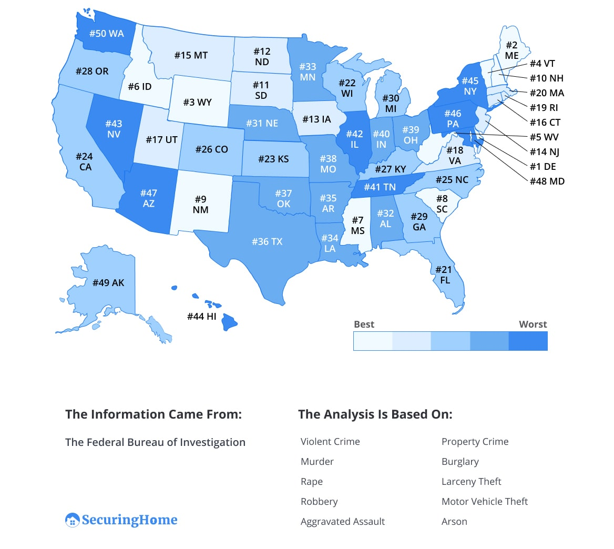
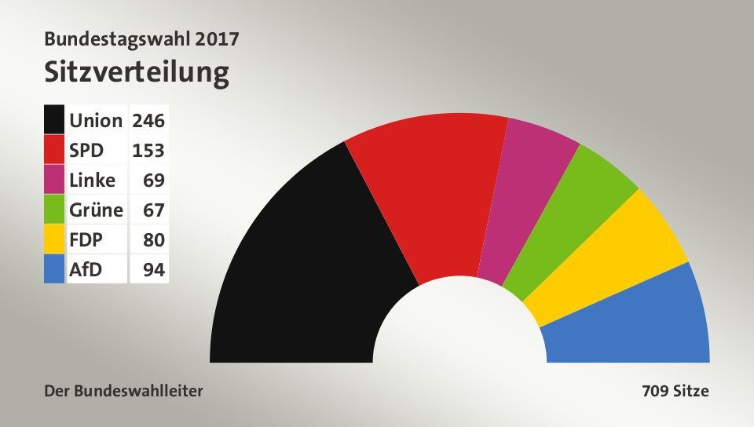
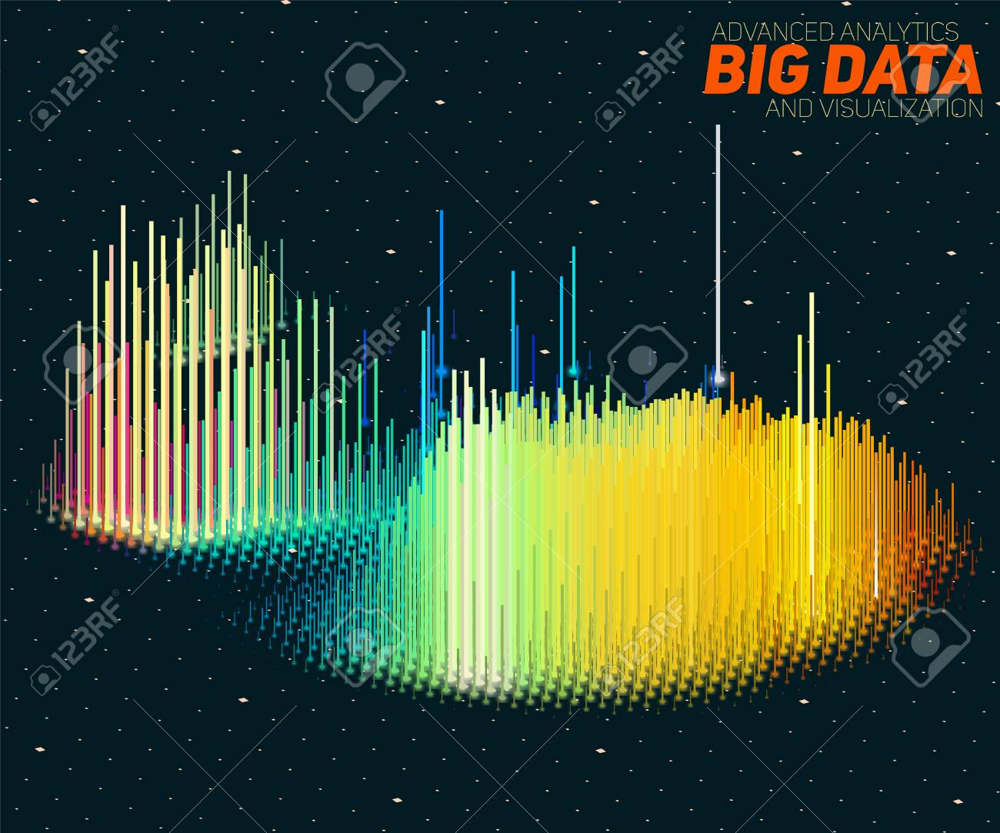

# Einführung in die Datenvisualisierung
**Autors**: Niklas Aßelmann, Mohammed Abdelal und Sulaxan Somaskantharajan

---

## Übersicht

- [1 Intro](#1-intro)
- [2 Nutzungsgebiet von Datenvisualisierungen](#2-Nutzungsgebiet-von-Datenvisualisierungen)
  * [2.1 Politik](#21-Politik)
  * [2.2 Naturwissenschaft](#22-Naturwissenschaft)
  * [2.3 Gesundheitswesen](#23-Gesundheitswesen)
  * [2.4 Finanzen](#24-Finanzen)
  * [2.5 Andere](#25-Andere)
- [3 Vor- und Nachteile](#3-Vor-und-Nachteile)
  * [3.1 Vorteile](#31-Vorteile)
  * [3.2 Nachteile](#32-Nachteile)
- [4 Regeln](#4-Regeln)
  * [4.1 Regeln für gute Datenvisualisierungen](#42-Regeln-für-gute-Datenvisualisierungen)
  * [4.2 Fehler](#42-Fehler)
- [5 Formen](#4-Formen)

---

## 1 Introduction
Was haben diese drei Bilder gemeinsam?
 Abbildung: Kriminalitätsrate in den USA Quelle:
https://securinghome.com/blog/crime-rate-by-state/
 Abbildung: Sitzverteilung in Bundestag, Quelle: https://www.bundestag.de/parlament/plenum/sitzverteilung17-259488 
 Abbildung: 3D Datenvisualisierung, Quelle:
https://de.123rf.com/

- Die Antwort auf diese Frage ist, dass alle drei Abbildungen Daten visualisieren. 
Aber was genau ist Datenvisualisierung?
- Definiert wird Datenvisualierung als die grafische Darstellung von Informationen und Daten.
- Durch den Einsatz von visuellen Elementen stellt die Datenvisualisierung eine leicht zugängliche Methode dar, um Trends, Ausreißer und Muster in Daten erkennen und verstehen zu können.
- Informationsvisualisierung: die Verwendung computergestützter, interaktiver, visueller Darstellungen abstrakter Daten zur Verstärkung der Wahrnehmung [[1](https://www.researchgate.net/publication/220691172_Readings_in_Information_Visualization_Using_Vision_To_Think)]

### Diagramm des Visualisierungsprocesses

- das folgende Diagramm zeigt den Process der Visualisierung

Der Benutzer kann mit der Visualisierung selbst und mit den Daten interagieren. Die Möglichkeit, mit diesen Elementen zu interagieren, ermöglicht es dem Benutzer, eine Reihe verschiedener Fragen zu beantworten.

Benutzer können mit der visuellen Darstellung interagieren, indem sie mit einem Computer interagieren. So kann er ändern **was** visualisiert wird und **wie** es visualisiert wird.

Das ermöglich die Problemlösung mit Daten mit **weniger Aufwand** in **kürzeren Zeit** und **genauer**.

### Warum visualisieren wir Daten?

Wir verwenden Visualisierung, um einige Phänomene besser zu verstehen. Wer Visualisierung verwendet und mit ihr interagiert, hat einige **Ziele**, die sich auf bestimmte Phänomene und mentale Modelle beziehen, **was** dieses Phänomen ist und **wie** es funktioniert.

Visualisierungssysteme verwenden Daten, visuelle Darstellungen und Interaktionen, um Menschen zu helfen, einige Phänomene besser zu verstehen.

### Warum benutzen wir Visualisierungen?

- Erläuternd
- Erforschend
- Bestätigend

---

## 2 Nutzungsgebiet von Datenvisualisierungen
### 2.1 Politik
- In der Politik werden Wahlergebnisse immer als Visualisierung angezeigt um es dem Publikum verständlich zu machen und es einfacher ist auf z. B. Balkendiagramme zu gucken als auf die "nackten Zahlen".
### 2.2 Naturwissenschaft
- In Zeiten von Big Data gehört die Datenanalyse zu den wohl wichtigsten Beschäftigungen in so gut wie jeder Naturwissenschaft. Ob Mathematik, Informatik oder andere Naturwissenschaften, das Analysieren der Daten ist essentiell um die Forschungsergebnisse zu belegen. Diese Ergebnis werden in fast alle Fällen als Visualisierung dargestellt um es auch dem Publikum verständlich zu machen, dass nicht so viel Erfahrung in dem Themenfeld hat.
### 2.3 Gesundheitswesen
- Auch im Gesundheitswesen werden Datenvisualisierungen genutzt. Zum Beispel die Ausbreitung einer Krankheit kann sehr gut auf einer Karte visualisiert werden.
### 2.4 Finanzen
- Auf dem Aktienmarkt wird der Verlauf einer Aktie immer visualisiert um Trends oder Ausreißer zu erkennen.
### 2.5 Andere
- Datenvisualisierungen sind in fast alle Feldern zu finden, die mit Datenbeschaffung, Daten Analyse oder Datenspeicherung arbeiten.

---

## 3 Vor- und Nachteile
### 3.1 Vorteile
- Daten einfach verstehen, klar kommuniziert
- Größeres Menge an Leute die deine Daten verstehen
- Bilden fundierte Grundlage für Entscheidungsfindung
#### 3.2 Nachteile
- Zu abstrakt (Wichtige Sachverhalte können nicht erkennbar sein)
- Kann zu Verzerrungen kommen
- Fehlinterpretationen

---

## 4 Regeln
### 4.1 Regeln für gute Datenvisualisierungen
#### 4.1.1 
- Die Datenvisualisierung sollte eine klare Botschaft haben
#### 4.1.2 
- Die Datenvisualisierung sollte einheitlichen Darstellungsregeln folgen
#### 4.1.3 
- Die Datenvisualisierung sollte einfach erfassbar sein
#### 4.1.4 
- Die Datenvisualisierung sollte schnell erfassbar sein
#### 4.1.5 
- Die Datenvisualisierung sollte eine hohe Informationsdichte vorweisen
#### 4.1.6 
- Die Datenvisualisierung sollte sich trotzdem auf das Wesentliche konzentrieren
#### 4.1.7 
- Die Datenvisualisierung sollte konkrete Handlungsoptionen aufzeigen
### 4.2 Fehler
- Um kritische Fehler beim Erstellen von Datenvisualisierungen zu vermeiden haben wir euch dieses Video rausgesucht, in dem es um die 7 Todsünden der Visualisierung geht. Hier geht es zum Video: 
- (https://www.youtube.com/watch?v=iqaJLHi92fA&list=WL&index=6&t=0s)

---

## 5 Formen von Datenvisualisierung
- Im Folgenden werden einigen Formen der Datenvisualisierung dargestellt (Bei manchen Darstellungen gibt es keinen deutschen Fachterminus). Außerdem werden verschiedenste Tools aufgezählt mit denwen diese Visualisierungen erstellt werden können.

### Datenvisualisierung Typen:

- **[1D/Linear](#1dlinear)**
- **[2D/Planar](#2dplanar)**
- **[3D](#3d)**
- **[Zeitlich](#zeitlich)**
- **[Multidimensional](#multidimensional)**
- **[Netzwerk](#netzwerk)**

### 1D/Linear:

Beispiele:

- Liste von Daten, welche nach einem einzigen Kriterium geordnet sind (z.B., alphabetisch)
- (wird gewöhnlich nicht visualisiert)

### 2D/Planar

Beispiele (Geospatial):

- **[Choroplethenkarte](https://de.wikipedia.org/wiki/Choroplethenkarte)**

    

    Tools: [GeoCommons](http://geocommons.com/), [Google Fusion Tables](http://code.google.com/apis/fusiontables/), [Google Maps API](https://developers.google.com/maps/), [Polymaps](http://polymaps.org/), [d3](http://d3js.org/)/[Protovis](http://mbostock.github.com/protovis/ex/choropleth.html), [Many Eyes](http://www-958.ibm.com/software/data/cognos/manyeyes/page/World_Map.html), [Google Charts](https://developers.google.com/chart/), [Tableau Public](http://www-958.ibm.com/software/data/cognos/manyeyes/), [Sci2](https://sci2.cns.iu.edu/), [TileMill](http://mapbox.com/tilemill/)

    Abbildung: March 20, 2018 by Ramiro Gómez. [Choropleth Map of the World in Python using GeoPandas](https://ramiro.org/notebook/geopandas-choropleth/).

- **[Kartenanamorphote](https://de.wikipedia.org/wiki/Kartenanamorphote)**

    

    Tools: [d3](http://d3js.org/)/[Protovis](http://mbostock.github.com/protovis/ex/cartogram.html) (Dorling Cartogram)

    Abbildung: 11 June 2017 by Ali Zifan, 2017 [Iranian presidential election maps](https://commons.wikimedia.org/wiki/File:Cartogram_of_Iran.svg)

- **[Dot distribution map](http://en.wikipedia.org/wiki/Dot_distribution_map)**

    

    Tools: [GeoCommons](http://geocommons.com/), [Google Fusion Tables](http://code.google.com/apis/fusiontables/), [Google Maps API](https://developers.google.com/maps/), [Polymaps](http://polymaps.org/), [Tableau Public](http://www-958.ibm.com/software/data/cognos/manyeyes/), [Sci2](https://sci2.cns.iu.edu/), [TileMill](http://mapbox.com/tilemill/)

    Abbildung:2015 by caliper, [distribution of the Hispanic and Non-Hispanic population](https://www.caliper.com/glossary/what-is-a-dot-density-map.htm).

- **[Proportional symbol map](http://en.wikipedia.org/wiki/Thematic_map#Proportional_symbol)**

    

    Tools: [GeoCommons](http://geocommons.com/), [Google Fusion Tables](http://code.google.com/apis/fusiontables/), [Google Maps API](https://developers.google.com/maps/), [Polymaps](http://polymaps.org/), [d3](http://d3js.org/)/[Protovis](http://mbostock.github.com/protovis/ex/symbol.html), [Many Eyes](http://www-958.ibm.com/software/data/cognos/manyeyes/page/World_Map.html), [Tableau Public](http://www-958.ibm.com/software/data/cognos/manyeyes/), [Sci2](https://sci2.cns.iu.edu/), [TileMill](http://mapbox.com/tilemill/)

    Abbildung: Merrillhope (2008). [A proportional symbol map depicting cities](https://en.wikipedia.org/wiki/Thematic_map#/media/File:BYUVocalPointStreamsUSA2018.jpg)

- **[Isolinie](https://de.wikipedia.org/wiki/Isolinie)**

    

    Tools: [TileMill](http://mapbox.com/tilemill/)

    Abbildung:Seattle U.S. Geological Survey based on a survey conducted in September 2014. [Chambers Lake](https://www.chesco.org/DocumentCenter/View/39129/ChambersLakeBathymetricMap_11x17_April2017?bidId=)

- **[dasymetric map](http://en.wikipedia.org/wiki/Thematic_map#Dasymetric)**

    

    Tools: R and QGIS.

    Abbildung: James Gleeson (2011).[Population density at MSOA level recalculated using only residential land as the denominator. Land use data from the EU Urban Atlas.](https://jamesjgleeson.wordpress.com/2013/01/23/dasymetric-map-of-londons-population-density-2011/)

### 3D

- Generelle Beispiele von [wissenschaftlichen Vizualisierungen](http://en.wikipedia.org/wiki/Scientific_visualization):

    - [3D Computer modelle](http://en.wikipedia.org/wiki/3D_modelling)
    - [Surface](http://en.wikipedia.org/wiki/Scientific_visualization#Surface_rendering) und [Volumen](http://en.wikipedia.org/wiki/Scientific_visualization#Volume_rendering) rendering
    - [Computer Simultionen](http://en.wikipedia.org/wiki/Scientific_visualization#Computer_simulation)

### Zetlich

- Beispiele:

  - **[Zeitleiste](https://de.wikipedia.org/wiki/Zeitleiste)**

      

      Tools: [SIMILE Timeline](http://www.simile-widgets.org/timeline/), [TimeFlow](https://github.com/FlowingMedia/TimeFlow/wiki/), [Timeline JS](http://timeline.verite.co/), [Excel](http://www.vertex42.com/ExcelArticles/create-a-timeline.html)

      Abbildung: [Timeline of reported human monkeypox outbreaks.](https://www.researchgate.net/publication/311880175_Human_Monkeypox_Current_State_of_Knowledge_and_Implications_for_the_Future) Source: based on data from Centers for Disease Control and Prevention , Formenty et al. (2010) , Learned et al. (2005) , International Federation of Red Cross and Red Crescent Societies (2016) , Damon et al. 2006.

  - **[Zeitreihenanalyse](https://de.wikipedia.org/wiki/Zeitreihenanalyse)**

      

      Tools: most statistical and charting software, R ([A Little Book of R for Time Series](http://a-little-book-of-r-for-time-series.readthedocs.org/en/latest/index.html)), [Timeplot](http://www.simile-widgets.org/timeplot/), [TimeSearcher](http://www.cs.umd.edu/hcil/timesearcher/), [Google Charts](https://developers.google.com/chart/), [Tableau Public](http://www-958.ibm.com/software/data/cognos/manyeyes/), [Google Fusion Tables](http://code.google.com/apis/fusiontables/)

      Abbildung: 4 December 2011 by Ldecola,[Tuberculosis incidence US 1953-2009](https://en.wikipedia.org/wiki/Time_series#/media/File:Tuberculosis_incidence_US_1953-2009.png)

  - **[Gantt-Diegramm](https://de.wikipedia.org/wiki/Gantt-Diagramm)**

      

      Tools: Excel

      Abbildung wurde in Exel mit zufälligen Daten erstellt.

  - **[Stream graph](http://en.wikipedia.org/wiki/Stream_graph)/[ThemeRiver](http://doi.ieeecomputersociety.org/10.1109/2945.981848)**

      

      Tools: [original Java code](https://github.com/leebyron/streamgraph_generator), [Data Wrapper](http://datawrapper.de/), [d3](http://d3js.org/)/[Protovis](http://mbostock.github.com/protovis/ex/stream.html), [HTML5/JavaScript](http://web.student.tuwien.ac.at/~e0725639/streamgraph/streamgraph.html), [Python](http://mechanicalintegrator.com/2010/drawing-stream-graphs/), [Excel](http://www.excelhero.com/blog/2010/04/excel-streamgraph.html),[R](https://www.r-graph-gallery.com/154-basic-interactive-streamgraph-2.html)

      Abbildung: Yan Holtz(2018), [Example with streamgraph library in R (interactive)](https://www.r-graph-gallery.com/154-basic-interactive-streamgraph-2.html)

  - **[Arc diagram](http://www.watson.ibm.com/cambridge/Technical_Reports/2002/TR2002-11.pdf)**

      

      (e.g., [Shape of Song](http://bewitched.com/song.html))

      Tools: ProtovisImage created by [sample Protovis code](http://mbostock.github.com/protovis/ex/arc.html).

  - **[Polar-Area Diagramm](http://en.wikipedia.org/wiki/Pie_chart#Polar_area_diagram)/rose/circumplex chart**

      

      Tools: [Protovis](http://mbostock.github.com/protovis/ex/crimea-rose.html), [Excel](http://www.excelcharts.com/blog/the-consultants-chart-revisited/),[R](http://conormclaughlin.net/2018/07/creating-circumplex-polar-bar-charts-in-r-with-ggplot2/)

      Abbildung:[Creating Circumplex (Polar Bar) Charts in R with ggplot2 example](http://conormclaughlin.net/2018/07/creating-circumplex-polar-bar-charts-in-r-with-ggplot2/)

### Multidimensional

- Beispiele für Zählungen:

  - **[Kreisdiagramm](https://de.wikipedia.org/wiki/Kreisdiagramm)**

      

      Tools: most statistical and charting software, [Many Eyes](http://www-958.ibm.com/software/data/cognos/manyeyes/page/Pie_Chart.html), [Google Charts](https://developers.google.com/chart/), [Tableau Public](http://www-958.ibm.com/software/data/cognos/manyeyes/), [Google Fusion Tables](http://code.google.com/apis/fusiontables/)

      Abbildung wurde in Exel mit zufälligen Daten erstellt.

  - **[Histogram](https://de.wikipedia.org/wiki/Histogramm)**

      

      Tools: most statistical and charting software, [Protovis](http://mbostock.github.com/protovis/ex/histogram.html), [Many Eyes](http://www-958.ibm.com/software/data/cognos/manyeyes/page/Block_Histogram.html)

      Abbildung: DanielPenfield. (2010). [Histogram_of_arrivals_per_minute](https://en.wikipedia.org/wiki/Histogram#/media/File:Histogram_of_arrivals_per_minute.svg).

  - **[Schlagwortwolke](https://de.wikipedia.org/wiki/Schlagwortwolke)**

      

      Tools: [Wordle](http://www.wordle.net/), [Many Eyes](http://www-958.ibm.com/software/data/cognos/manyeyes/page/Word_Cloud_Generator.html), [d3](https://github.com/jasondavies/d3-cloud)

      Abbildung: In2thats12. (2010). [Foundation-l_word_cloud_without_headers_and_quotes.](https://en.wikipedia.org/wiki/Tag_cloud#/media/File:Foundation-l_word_cloud_without_headers_and_quotes.png)

  - **Balkendiagramm**

      

      Tools: most statistical and charting software, [Many Eyes](http://www-958.ibm.com/software/data/cognos/manyeyes/page/Bar_Chart.html), [Google Charts](https://developers.google.com/chart/), [Tableau Public](http://www-958.ibm.com/software/data/cognos/manyeyes/), [High Charts](http://www.highcharts.com/products/highcharts), [Google Fusion Tables](http://code.google.com/apis/fusiontables/)

      Abbildung wurde in Exel mit diesen Daten erstellt: [Anscombe's quartet](http://en.wikipedia.org/wiki/Anscombe%27s_quartet).

- Beispiele für Beziehungen zwischen den Variablen:

  - **[Streudiagramm](https://de.wikipedia.org/wiki/Streudiagramm)**

      

      Tools: most statistical and charting software, [Many Eyes](http://www-958.ibm.com/software/data/cognos/manyeyes/page/Scatterplot.html),[Google Charts](https://developers.google.com/chart/), [Tableau Public](http://www-958.ibm.com/software/data/cognos/manyeyes/), [Google Fusion Tables](http://code.google.com/apis/fusiontables/)

      Abbildung wurde in Exel mit diesen Daten erstellt: [Anscombe's quartet](http://en.wikipedia.org/wiki/Anscombe%27s_quartet).

  - **[Blasendiagramm](https://de.wikipedia.org/wiki/Blasendiagramm)**

      

      Tools: Excel, [d3](http://d3js.org/), Gapminder, [Google Charts](https://developers.google.com/chart/), [Tableau Public](http://www-958.ibm.com/software/data/cognos/manyeyes/)

      Abbildung: Kokcharov (2017). [The example of the Portfolio Management Simulation SimulTrain uses different areas and colors of the bubbles.](https://en.wikipedia.org/wiki/Bubble_chart#/media/File:Net_Present_Value_vs_Payback_time_Portfolio_Management_Simulation.jpg)

  - **[Liniendiagramm](https://de.wikipedia.org/wiki/Liniendiagramm)**

      

      Tools: most statistical and charting software, [Many Eyes](http://www-958.ibm.com/software/data/cognos/manyeyes/page/Line_Graph.html), [Google Charts](https://developers.google.com/chart/), [Tableau Public](http://www-958.ibm.com/software/data/cognos/manyeyes/), [Google Fusion Tables](http://code.google.com/apis/fusiontables/)

      Tips: Aisch, G. (2012). [Doing the line charts right](http://vis4.net/blog/posts/doing-the-line-charts-right/).

      Image:Copley, Z. (2012). [Annual Mean Temperature Charts](http://www.flickr.com/photos/zcopley/7513082668).

  - **[Heatmap](https://de.wikipedia.org/wiki/Heatmap)**

      

      Tools: Excel (conditional formatting), [d3](http://d3js.org/) (calendar), [Protovis](http://mbostock.github.com/protovis/ex/nba.html)

      Abbildung wurde in Exel mit diesen Daten erstellt: [Anscombe's quartet](http://en.wikipedia.org/wiki/Anscombe%27s_quartet).

  - **[Box-Plot](https://de.wikipedia.org/wiki/Box-Plot)**

      

      Tools: most statistical and charting software, [Protovis](http://mbostock.github.com/protovis/ex/box-and-whisker.html), [Google Charts](https://developers.google.com/chart/)

      Abbildung :Schutz. (2006). [Boxplot representing Michelson and Morley's data on the speed of light](http://commons.wikimedia.org/wiki/File:Michelsonmorley-boxplot.svg).Public Domain

### Netzwerk

- Beispiele fur Netzwerkvisualisierungen:

  - **Matrix**

      

      Tools: [d3](http://d3js.org/)/[Protovis](http://mbostock.github.com/protovis/ex/matrix.html)

      Abbildung erstellt von [sample Protovis code](http://mbostock.github.com/protovis/ex/matrix.html).

  - **Abhängigkeitsgraph**

      

      Tools: [d3](http://d3js.org/), [Network Workbench](http://nwb.cns.iu.edu/)/[Sci2](https://sci2.cns.iu.edu/)

      Abbildung wurde in [d3](http://d3js.org/) erstellt.

  - **U-Bahn Plan**

      

      Tools: [Subway map jQuery plugin](http://www.kalyani.com/2010/10/subway-map-visualization-jquery-plugin/)

      Abbildung :Transport for London 06/2020,Transport for London | [Via Gizmodo](http://gizmodo.com/new-london-tube-maps-shows-how-long-it-takes-to-walk-n-1741879484)
