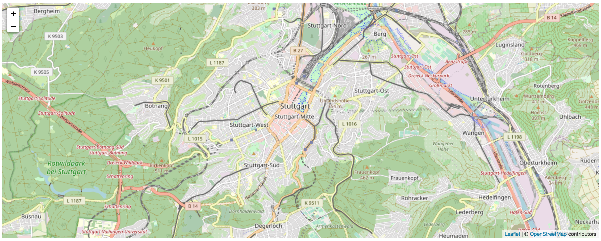

# Einführung in Leaflet
**Autors**: Niklas Aßelmann, Mohammed Abdelal und Sulaxan Somaskantharajan

---

## Übersicht

- [1 Was ist Leaflet?](#1-Was-ist-Leaflet)
- [2 Die erste Karte mit Leaflet](#2-Die-erste-Karte-mit-Leaflet)
  * [2.1 Das HTML-Dokument vorbereiten](#21-Das-HTML-Dokument-vorbereiten)
  * [2.2 LeafletJS](#22-LeafletJS)


---

## 1 Was ist Leaflet?

Leaflet ist eine Open-Source JavaScript-Bibliothek für interaktive, nutzerfreundliche Karten. Leaflet verwendet HTML und CSS und wird von allen gängigen Webbroswern, wie Google Chrome, Firefox oder Safari auf Desktop-, sowie Mobilgeräten unterstützt. 

Eine Karte ist bereits mit wenigen Zeilen Code und ohne großem Vorwissen in der Programmierung erstellbar. Zudem ist Leaflet sehr einfach mit weiteren Plugins erweiterbar. In diesem Tutorial beschränken wir uns jedoch auf das einfache Erstellen von nutzerfreundlichen Karten. Wie man ein zusätzliches Plugin erstellt, welches die bereits große Anzahl an bereitgestellten Funktionen erweitert, wird nicht besprochen.

Wer sich für die gebotenen Möglichkeiten und Funktionen von Leaflet interessiert kann diese in der sehr ausführlichen, aber dennoch gut strukturierten [Dokumentation](https://leafletjs.com/reference-1.6.0.html) nachlesen.

## 2 Die erste Karte mit Leaflet

Nun kommen wir zur Step-by-Step Anleitung zur Erstellung einer einfachen Karte in einem beliebigen Webbrowser.

Für die Programmierung ist ein Texteditor notwendig. Wir empfehlen an dieser Stelle den Online HTML-Editor [Codepen](https://codepen.io). Es können aber auch andere HTML-Editoren, wie [Brackets](http://brackets.io) oder [Atom](https://atom.io) verwendet werden, welche für das Erstellen von Webanwendungen gut geeignet sind. Ein einfacher Notepad-Editor reicht bereits auch schon.

### 2.1 Das HTML-Dokument vorbereiten
Zunächst bereiten wir unser HTML-Dokument vor. Öffne dazu deinen Texteditor und füge den folgenden Code deinem Dokument hinzu, womit die Struktur deiner Webseite definiert wird:
```
<!DOCTYPE html>

<html>

  <head>

    <title>Leaflet Web Map</title>

    <style>

    </style>

  </head>

  <body>

    <script>

    </script>

  </body>

</html>
```

Speicher dieses Dokument als "index.html" ab, sofern Du **keinen** Online-Editor verwendest.

Um die Funktionen von Leaflet zu benutzen ist es nötig die vorprogrammierten CSS- und JavaScript-Dateien in unserem Dokument zu integrieren.

Füge dazu in dem ```<head>``` Teil deines Dokumentes Leaflet CSS hinzu:

```
<link
      rel="stylesheet"
      href="https://unpkg.com/leaflet@1.6.0/dist/leaflet.css"
      integrity="sha512-xwE/Az9zrjBIphAcBb3F6JVqxf46+CDLwfLMHloNu6KEQCAWi6HcDUbeOfBIptF7tcCzusKFjFw2yuvEpDL9wQ=="
      crossorigin=""
    />
```

Anschließend Leaflet JavaScript. Beachte, dass Leaflet JavaScript **nach** Leaflet CSS eingebunden werden muss.

```
<script
      src="https://unpkg.com/leaflet@1.6.0/dist/leaflet.js"
      integrity="sha512-gZwIG9x3wUXg2hdXF6+rVkLF/0Vi9U8D2Ntg4Ga5I5BZpVkVxlJWbSQtXPSiUTtC0TjtGOmxa1AJPuV0CPthew=="
      crossorigin=""
    ></script>
```

Für die Leaflet-Karte erstellen wir ein ```<div>``` Element mit der id "map" im ```<body>``` Teil des Dokumentes, welches die Karte enthalten soll:

```
<div id="map"></div>
```

Stelle sicher, dass das ```<div>``` Element eine definierte Höhe hat, indem du ihn beispielsweise in CSS festlegst. Dazu den folgenden Code zwischen den ```<style>``` Tags im ```<head>``` Teil platzieren:

```
#map { height: 500px; }
```

### 2.2 LeafletJS

Nun kannst du deine erste Karte initialisieren.

Stelle stets sicher, dass der JavaScript Code nach dem ```<div>``` Element, welches die Karte enthält, eingebunden wird. 

Wir stellen die Ansicht auf das Zentrum von Stuttgart und bestimmen eine Zoomstufe. Platziere dazu den folgenden Code zwischen den ```<script>``` Tags im ```<body>``` Teil.

```
var map = L.map('map').setView([48.775, 9.182], 13);
```

Füge als nächstes deiner Karte einen Tilelayer hinzu. In diesem Fall handelt es sich um den Tilelayer "OpenStreetMap". Das Erstellen eines Tilelayers umfasst normalerweise die Definition der URL-Vorlage für die Layerbilder und des Beschreibungstextes.

```
L.tileLayer('http://{s}.tile.osm.org/{z}/{x}/{y}.png', {
        attribution: '&copy; <a href="http://osm.org/copyright">OpenStreetMap</a> contributors'}).addTo(map);
```



**Übung:**
1) Finde heraus wofür die Zahlen 48.775, 9.182 und 13 stehen?
2) Erstelle eine Karte auf der Münster im Zentrum zu sehen ist und stelle das Zoomlevel so ein, dass die Stadt Dortmund auf der Karte zu sehen ist.

Glückwunsch! Nun solltest du deine erste funktionierende Leafletkarte erstellt haben.

Lass uns nun versuchen die Karte mit weiterem Inhalt zu füllen. Wir entscheiden uns einen Marker der Karte hinzuzufügen. Einen Marker erstellen wir ganz einfach durch folgenden Code:

```
var marker = L.marker([51.962, 7.595]).addTo(map);
```

Wir können diesen Marker ganz einfach mit einem Popup beschreiben:

```
marker.bindPopup("Geo 1 an der WWU").openPopup();
```
**Übung:**
1) Füge die Fußballstadien Allianz Arena (München) und Signal Iduna Park (Dortmund) der Karte als Marker hinzu.
2) Beschreibe beide Marker, indem du Ihnen den Namen der Stadien gibst.

Du kannst auch andere geographische Objekte, wie Kreise, Polygone oder Polylinien der Karte hinzufügen.

Einen Kreis fügst du analog zum Marker ähnlch simpel der Karte hinzu. Dazu bestimmst du die Koordinaten des Kreismittelpunktes und den Radius. Das folgende Beispiel zeigt zudem, wie man den Kreis individuell definieren kann.

```
var circle = L.circle([51.568, 7.11], {
    color: 'red',
    fillColor: '#f03',
    fillOpacity: 0.5,
    radius: 500
}).addTo(map);
```
Analog zum Marker ist es auch hier möglich einen Popup zu erstellen:

```
circle.bindPopup("Ich bin ein Popup im Nirgendswo").openPopup();
```

**Übung**:

In Münster herscht starkes Unwetter. Im Umkreis von 20 km wird die Bevölkerung gebeten ihr Haus nicht zu verlassen. Zeige die Gefahrenzone auf der Leafletkarte an und gib ihr eine entsprechende Beschreibung.

